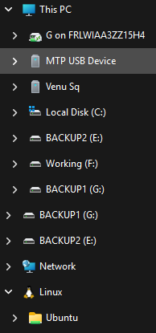
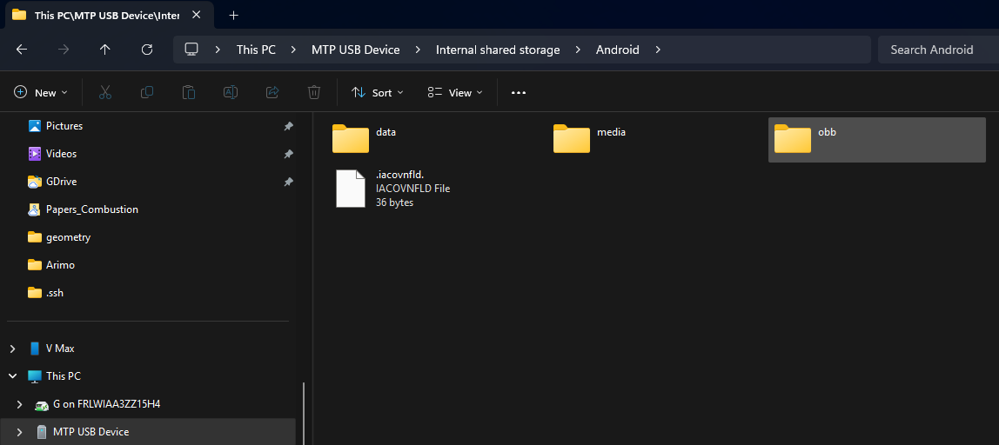
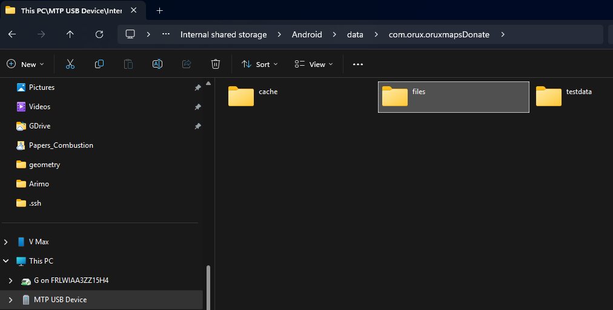
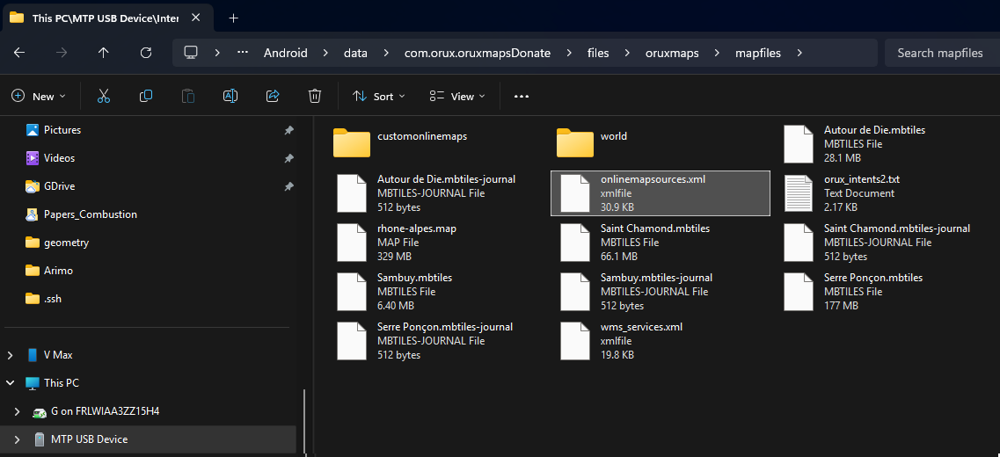

# OruxMaps

Ce répertoire contient des notes et des ressources pour l'ajout de cartes IGN sur OruxMaps. Lisez attentivement jusqu'à la fin avant de commencer à apporter des modifications.

## Introduction

Pour ajouter des cartes IGN sur OruxMaps, il nous faut ajouter des entrées `<onlinemapsource>` au fichier `onlinemapsources.xml` à la racine du système Android. Cela est souvent problématique car il faut accéder à des fichiers restreints sur son téléphone. Il est donc conseillé de le faire depuis un ordinateur avec le téléphone branché en mode de transfert de fichiers, où le système Android n'est pas en mesure d'empêcher l'accès à ces fichiers.

Le fichier `onlinemapsources.xml` se trouve sous `Android/data/com.orux.oruxmapsDonate/files/oruxmaps/mapfiles` dans les configurations de l'application. Un fichier XML est un fichier texte avec des balises (*tags*) qui structurent les données de façon à les rendre facilement lisibles par un logiciel. Étant un fichier texte, nous pouvons utiliser le *Bloc-notes* classique de Windows pour le lire et le modifier. Pour les personnes plus à l'aise avec la programmation, un éditeur de code avec coloration syntaxique est préférable, permettant d'identifier facilement les erreurs.

La structure de `onlinemapsources.xml` est très simple : en haut, nous avons un *en-tête* `<?xml version="1.0" encoding="utf-8"?>` qui indique au logiciel qui le lit qu'il s'agit d'un fichier XML et quel encodage utiliser. Ensuite, nous avons une balise *racine* `onlinemapsources` qui englobe toutes les autres entrées sous forme de liste. Nous pouvons ajouter des commentaires au fichier en encadrant un bloc de texte avec `<!-- ... -->`, comme dans l'exemple ci-dessous :


```xml
<?xml version="1.0" encoding="utf-8"?>
<onlinemapsources>

	<onlinemapsource uid="1">
		<name>Geoplateforme IGN SCAN25</name>
		<url><![CDATA[https://data.geopf.fr/private/wmts?Service=WMTS&apikey=ign_scan_ws&LAYER=GEOGRAPHICALGRIDSYSTEMS.MAPS.SCAN25TOUR&Style=normal&TileMatrixSet=PM&Request=GetTile&Version=1.0.0&Format=image/jpeg&TileMatrix={$z}&TileCol={$x}&TileRow={$y}]]></url>
		<website><![CDATA[<a href="https://www.ign.fr/geoplateforme" target="_blank">Géoplateforme IGN</a>]]></website>
		<minzoom>2</minzoom>
		<maxzoom>16</maxzoom>
		<projection>MERCATORESFERICA</projection>
		<servers></servers>
		<httpparam name="User-Agent">{om}</httpparam>
		<cacheable>1</cacheable>
		<downloadable>1</downloadable>
		<maxtilesday>0</maxtilesday>
		<maxthreads>0</maxthreads>
		<xop></xop>
		<yop></yop>
		<zop></zop>
		<qop></qop>
		<sop></sop>
	</onlinemapsource>

    <!-- autres entrées ici ... -->

</onlinemapsources>
```

Le plus important lors de l'ajout de nouvelles entrées est que chaque carte doit avoir un identifiant (`uid`) unique. La numérotation des `uid` est arbitraire (bonne pratique : utiliser une suite d'entiers). Si vous le fusionnez avec un autre fichier, veillez à adapter les `uid` au besoin, sans quoi OruxMaps ne pourra pas les identifier et ne les affichera pas.

## Tutoriel

1. Branchez votre téléphone Android à votre ordinateur en mode transfert de fichiers ; identifiez le disque correspondant à votre appareil sous **Ce PC** :



2. Naviguez jusqu'à `Android` en suivant l'exemple ci-dessous :



3. Poursuivez la navigation dans le sous-dossier `data` pour arriver à `Android/data/com.orux.oruxmapsDonate/` :



4. Enfin, dans ce dossier, naviguez vers `files/oruxmaps/mapfiles` où se trouve `onlinemapsources.xml` :



5. Il n'est pas conseillé de modifier ce fichier directement sur place ; faites deux copies (`onlinemapsources.xml` et `onlinemapsources.xml.bak`) de ce fichier à un endroit de votre choix, souvent le Bureau (*Desktop*). Effacez le fichier `onlinemapsources.xml` présent dans le dossier `mapfiles` de votre téléphone.

6. Ouvrez `onlinemapsources.xml` avec un éditeur (clic droit -> Ouvrir avec... -> choisir le Bloc-notes si vous n'avez pas d'éditeur de code), repérez la balise `<onlinemapsources>` et ajoutez les entrées de votre choix juste après cette ligne.

7. Vérifiez bien que toutes les entrées ont un `uid` différent de ceux déjà existants et que les balises sont correctement formées.

8. Sauvegardez `onlinemapsources.xml` et copiez-le dans le dossier `files/oruxmaps/mapfiles` du téléphone (veillez à bien avoir supprimé le fichier avant comme indiqué ci-dessus, coller par-dessus ne fonctionne pas ici).

9. Débranchez votre téléphone, puis relancez OruxMaps sur le téléphone (forcer l'arrêt et relancer). Ouvrez l'application et testez les nouvelles cartes.

Le fichier avec des entrées utiles se trouve [ici](onlinemapsources.xml) ; en général pour une pratique en montagne, les trois premières cartes sont suffisantes (IGN SCAN25, IGN Pentes, IGN Courbes de niveau). Si vous le souhaitez, vous pouvez remplacer votre `onlinemapsources.xml` par celui-ci directement (la majorité des entrées présentes dans le fichier fourni par défaut avec OruxMaps sont inutiles pour un usage en France).

## Références

- [Forum OruxMaps](https://oruxmaps.org/forum/index.php?topic=44755.0)
- [Tyber Randos](https://rando.tybern.fr/telechargements/CartesEnLigne/)
